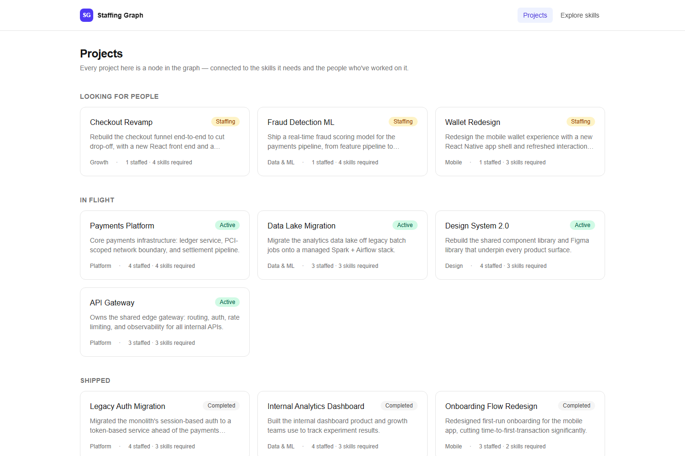
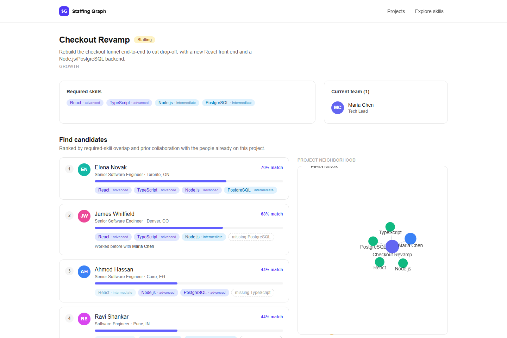
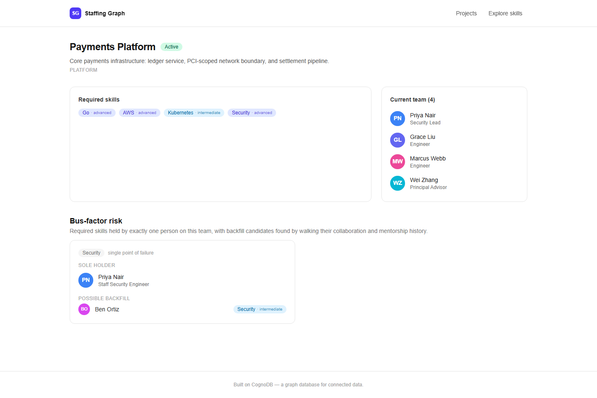
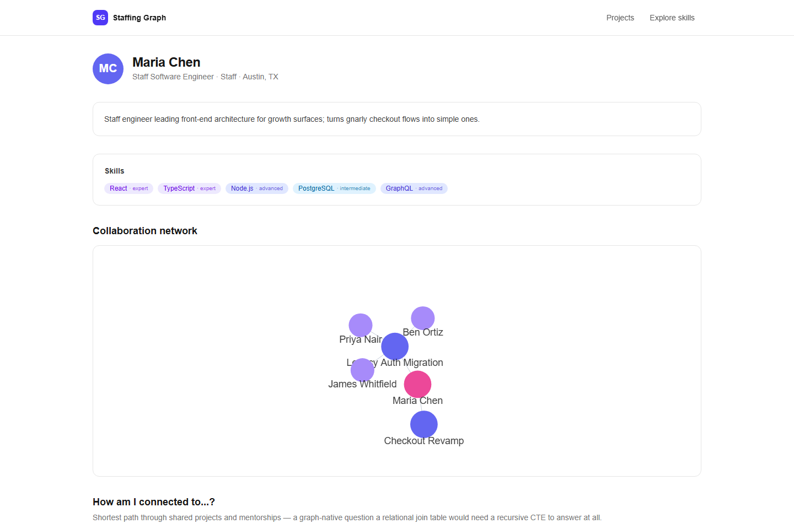
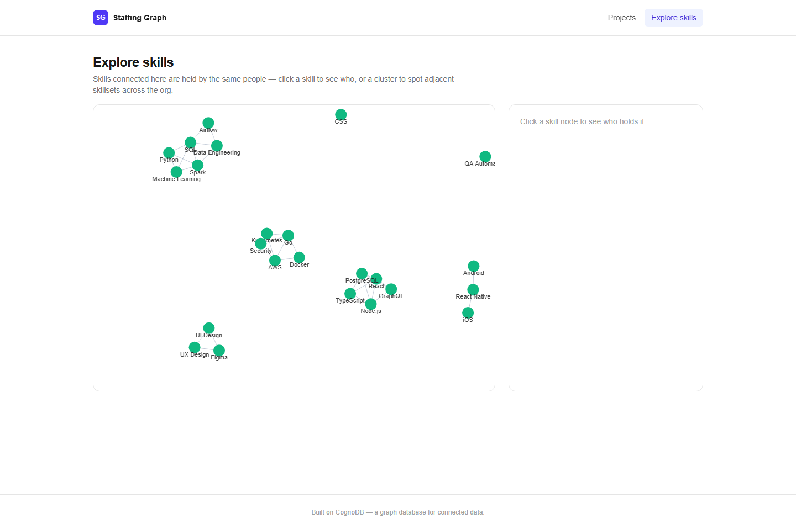

# Staffing Graph

Find the right people for the right project — powered by [CognoDB](https://console.cognodb.com), a managed graph database.

**Live demo:** _add hosted URL here_
**Screen recording:** _add link here_

---

## 1. The use case: team staffing as a graph problem

Every engineering org eventually asks the same question: *"We're starting Project X — who should staff it?"*

The obvious answer — "match required skills against people's skill lists" — is a single join and any relational
database handles it fine. But the question that actually matters to a hiring manager is richer:

> Who has the right skills, **and** has already worked well with the people already on this team, **and**, if we
> lose our one security expert to another project, who could realistically backfill them?

That's not a join anymore — it's a graph walk. This app models an engineering org as a graph of **people**,
**skills**, **projects**, and **teams**, and answers three staffing questions a spreadsheet or SQL schema makes
awkward:

1. **"Who should staff this project?"** — rank candidates by skill overlap *and* prior collaboration with the
   existing team (a 2-hop `Person → Project ← Person` traversal).
2. **"What's our bus-factor risk?"** — find skills held by exactly one person on a project's team, then find
   backfill candidates by walking that person's collaboration and mentorship history up to 2 hops out.
3. **"How is person A connected to person B?"** — shortest path through shared projects and mentorships, of
   arbitrary length.

## 2. Why a graph database?

- **The interesting query is a variable-length walk, not a fixed join.** "Who has worked with someone on this
  team, on some other project, at some point" is a self-join with no fixed depth. In SQL that's a recursive CTE
  (or a hand-rolled loop in application code) even for a 2-hop version. In Cypher it's
  `(candidate)-[:WORKED_ON]->(p)<-[:WORKED_ON]-(existingMember)` — one line, and it reads the way you'd say it
  out loud.
- **Bus-factor backfill is inherently multi-hop and multi-relationship-type.** Finding "who could plausibly cover
  this skill" means walking `WORKED_ON` *and* `MENTORED` edges together, 1–2 hops out, from a specific person.
  That's a single pattern in Cypher (`(soleHolder)-[:WORKED_ON|MENTORED*1..2]-(backfill)`); in a relational schema
  it's a union of self-joins across two different bridge tables, repeated per hop.
- **Shortest-path queries are native, not simulated.** "How is Alice connected to Bob?" is `shortestPath(...)` in
  Cypher. In SQL it's usually solved by giving up and building a separate graph-processing step outside the
  database.
- **The schema grows without re-normalizing.** Adding a new kind of connection (e.g. "reports to", "same team",
  "reviewed each other's design docs") is a new relationship type, not a new bridge table and a new set of joins
  bolted onto every existing query.
- **Traversal cost stays flat as the graph grows**, because a graph database follows pointers (index-free
  adjacency) instead of computing a join at query time. A 2-hop "who's collaborated with whom" query doesn't get
  proportionally more expensive as the org grows the way a multi-table SQL join would.

None of this is to say a relational database *couldn't* answer these questions — it's that every one of them
would need either a recursive CTE, a stack of self-joins, or logic pulled out into application code. Here they're
each a single, readable Cypher pattern.

## 3. Data model

```
                      ┌────────────┐
        ┌────────────▶│   Skill    │◀───────────────┐
        │ HAS_SKILL    │ name       │  REQUIRES_SKILL │
        │ {level,      │ category   │  {minLevel}     │
        │  years}      └────────────┘                 │
        │                                              │
  ┌───────────┐   WORKED_ON        ┌────────────┐      │
  │  Person   │───────────────────▶│  Project   │──────┘
  │ id, name  │  {role, start,     │ id, name   │
  │ title,    │   end}             │ description│
  │ seniority,│                    │ domain     │
  │ location, │◀──────────────────┐│ status     │
  │ bio       │   MEMBER_OF        │└────────────┘
  └───────────┘        │
        │  ▲            ▼
        │  │      ┌────────────┐
        └──┘      │    Team    │
      MENTORED     │ id, name   │
   {skill}         └────────────┘
```

**Nodes**

| Label     | Key properties                                              |
|-----------|---------------------------------------------------------------|
| `Person`  | `id`, `name`, `title`, `seniority`, `location`, `bio`, `avatarColor` |
| `Skill`   | `name`, `category`                                             |
| `Project` | `id`, `name`, `description`, `domain`, `status`                |
| `Team`    | `id`, `name`                                                    |

**Relationships**

| Type              | Direction                | Properties               |
|-------------------|---------------------------|---------------------------|
| `HAS_SKILL`       | `Person → Skill`          | `level`, `years`          |
| `REQUIRES_SKILL`  | `Project → Skill`         | `minLevel`                |
| `WORKED_ON`       | `Person → Project`        | `role`, `start`, `end`    |
| `MEMBER_OF`       | `Person → Team`           | —                          |
| `MENTORED`        | `Person → Person`         | `skill`                   |

Seed dataset: 26 people, 30 skills, 5 teams, 11 projects (3 open "staffing" roles, 4 active, 4 completed),
~90 `HAS_SKILL`, 35 `REQUIRES_SKILL`, 32 `WORKED_ON`, and 7 `MENTORED` relationships — sized well within CognoDB's
free-tier limits.

## 4. Setup

### 4.1 Create a CognoDB Cloud instance

1. Sign up at [console.cognodb.com/signup](https://console.cognodb.com/signup) (no credit card required).
2. Create a free **c0** instance and pick a region. It provisions in under a minute.
3. Copy the connection URI (`bolt+s://<instance-id>.databases.cognodb.cloud`) and the generated password for
   user `cognodb` — **the password is shown once**.

### 4.2 Configure the app

```bash
cp .env.example .env.local
```

Fill in `.env.local`:

```
NEO4J_URI=bolt+s://<instance-id>.databases.cognodb.cloud
NEO4J_USERNAME=cognodb
NEO4J_PASSWORD=<your-generated-password>
```

### 4.3 Install, seed, run

```bash
npm install
npm run seed   # loads the sample dataset via parameterized Cypher (scripts/seed.ts)
npm run dev    # http://localhost:3000
```

`npm run seed` is idempotent — it wipes the graph and reloads the full dataset each time, so it's safe to re-run.

## 5. The main queries, explained

All queries live in [`src/lib/queries.ts`](src/lib/queries.ts) and run through the official `neo4j-driver`
with parameterized Cypher (no string concatenation anywhere).

- **`getCandidatesForProject`** — the centerpiece. Fetches everyone who holds at least one required skill
  (`Person -[:HAS_SKILL]-> Skill`), separately fetches who's collaborated before with the project's current team
  (`ExistingMember -[:WORKED_ON]-> Project <-[:WORKED_ON]- Candidate`, a 2-hop chain), then blends a skill-match
  score with a collaboration score in application code. Powers the ranked candidate list and the project
  neighborhood graph.
- **`getBusFactorRisks`** — for a project's required skills, finds any skill held by exactly one current team
  member, then walks `WORKED_ON|MENTORED` edges 1–2 hops from that person to surface plausible backfills who
  already hold the skill at some level.
- **`getConnectionPath`** — `shortestPath((a)-[:WORKED_ON|MENTORED*1..6]-(b))` between any two people: a
  variable-length, multi-relationship-type traversal with no fixed depth.
- **`getPersonNetwork`** — a person's projects and everyone else who worked on those same projects, for the
  force-directed graph on the person page.
- **`getSkillGraph`** — skills that tend to be held by the same people (`Skill <-[:HAS_SKILL]- Person
  -[:HAS_SKILL]-> Skill`), for the Explore page.

### A note on CognoDB compatibility

While building the candidate-ranking query, I found that CognoDB's current query planner does not reliably
evaluate relationship-existence checks between two **independently bound** nodes — e.g.
`NOT (candidate)-[:WORKED_ON]->(proj)`, where `candidate` and `proj` are each bound in separate, earlier `MATCH`
clauses. That pattern silently matched incorrectly (it behaved as if checking for *any* `WORKED_ON` edge,
ignoring which project was bound). The same issue showed up with `OPTIONAL MATCH ... WHERE <property filter>`
used for exclusion.

The fix, confirmed by direct testing against the instance: keep multi-hop patterns as a **single, unbroken
`MATCH` chain** (e.g. `(existingMember)-[:WORKED_ON]->(sharedProject)<-[:WORKED_ON]-(candidate)` in one clause),
and push set-difference / exclusion logic (e.g. "which candidates are already staffed") into a small, separate,
single-purpose query whose result is filtered in application code. Every query in `queries.ts` that needs this is
commented with why. It's a good demonstration of validating a young database against real queries rather than
assuming spec compliance — happy to walk through the exact repro in the interview.

## 6. Engineering notes

- **Connection details** are read from environment variables only (`src/lib/neo4j.ts`); `.env.local` is
  git-ignored. `.env.example` documents the required variables.
- **Graceful degradation**: `withSession()` wraps all driver calls and translates connectivity failures into a
  typed `DatabaseUnavailableError`, which the API layer (`src/lib/api.ts`) turns into a clean `503` response.
  `/api/health` surfaces connectivity status directly, and the app's `error.tsx` boundary renders a readable
  message instead of a stack trace if the database is unreachable.
- **Parameterized queries** throughout — every `tx.run()` call passes a params object; nothing is
  string-interpolated into Cypher.
- **Project structure**:
  - `src/lib/` — driver singleton, query functions, shared types, API error handling
  - `src/app/api/` — REST route handlers (thin wrappers over `lib/queries.ts`)
  - `src/app/` — pages (server components for initial data, client components for interactive graphs)
  - `src/components/` — `GraphView` (force-directed viz), UI primitives, page-level client components
  - `scripts/` — `seed.ts` and the seed dataset (`scripts/data/`)

## 7. Screenshots

**Dashboard** — projects grouped by staffing status:


**Candidate ranking** — skill match + collaboration history, with a live neighborhood graph:


**Bus-factor risk** — single points of failure and their backfills:


**Person profile** — skills and collaboration network:


**Explore skills** — which skills cluster together across the org:


## 8. Tech stack

Next.js 16 (App Router, TypeScript) · Tailwind CSS · `neo4j-driver` · `react-force-graph-2d` · CognoDB Cloud
